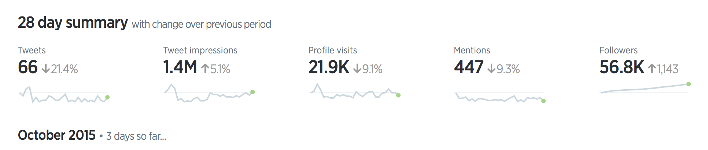
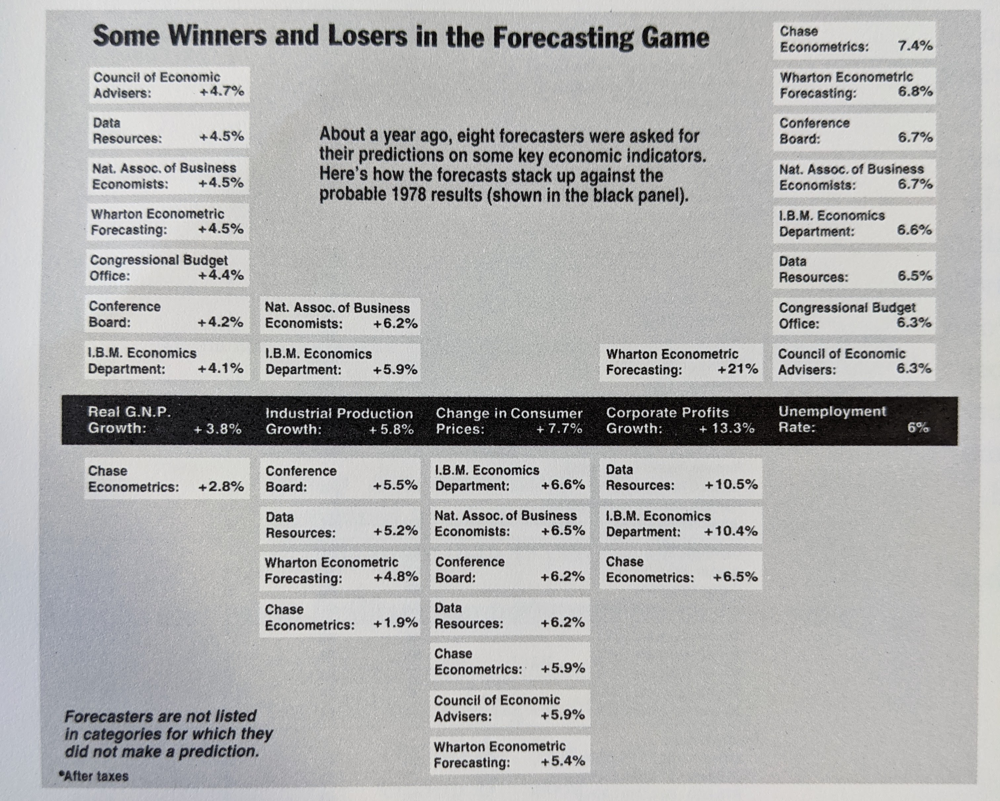

```{r global-options, include=FALSE}
knitr::opts_chunk$set(echo = TRUE, 
                      warning = FALSE, 
                      message = FALSE,
                      R.options = list(width=80),
                      fig.align="center")
```

## Background

In my pursuit of professional growth and skill development, I have recently turned to design theory, visualization best practices, and authors who are held in high regard for these principles. One such author I have particularly enjoyed is Edward Tufte. After reading "The Visual Display of Quantitative Information", I was left with a dozen or so bookmarks of charts and visualization examples to replicate or incorporate into future work. Leveraging my backing in Tableau and R (& my growing skills in Power BI) and a wealth of data viz opportunities from community challenges including \#MakeoverMonday, \#RWFD, and \#TidyTuesday, I thought this would be a perfect excuse to incorporate the lessons learned from Tufte into my work, blog about the development of visualizations, and reflect on the practicality and use-case of each particular lesson from Tufte (and others!).

{width="50%"}

## Sparklines and Datawords

For the seasoned data analyst or data visualizer out there, I will venture to guess the concept of sparklines and datawords will not be a foreign concept. While the term Tufte uses may be new, this type of visual goes by many names (for example callout numbers, callout boxes, dashboard cards, visual annotations) and is ubiquitous with business dashboards and sporting visuals, to name a few. What I found compelling from Tufte's writing was the extent to which these visuals can derive meaning, capitalize on context, and push the boundaries of data presented within a relatively small footprint. I'll go into detail on what I mean by this in the next section.

At its core, sparklines and datawords are, as Tufte puts it, "data-intense, design simple, word-sized graphics". Sparklines and datawords can simply compliment a textbox or act as standalone visual to call attention to a single measurement, but they can also be used as a comprehensive visualization in the form of a small multiples visual or combined with a large table of data.




When I encountered this concept in Tufte's book, I knew I wanted to capitalize on the effectiveness of sparklines and design an entire dashboard around this idea. Fortunately, \#MakeoverMonday's weekly challenge covered global cash crops and the dataset provided had a variety of contextually relevant and interconnected dimensions. Additionally, Tufte provided an example of a visualization on forecasting economic indices in his book (page 180) with a template which I found to be perfect for this week's \#MM challenge.

{width="75%"}

After close examination, this visual has a few important characteristics I plan to replicate in a Tableau dashboard. Namely:

* Some kind of baseline or average value/dataword established across all dimensions (i.e. the black panel)
* Columns of datawords arranged ascending/descending based on the baseline value - in this example, based on how close they were to the baseline forecast
* Standardized containers for each dimension and value across the visual
* Descriptions or legends placed organically in blank areas caused by the arrangement of the datawords


## Building a sparkline and dataword dashboard

Up to this point, I have covered the why, the what, and the so what; now we will cover the how.

{width="50%"}


Taking advantage of the global cash crops dataset posted to [dataworld](https://data.world/makeovermonday/2021w11) for \#MakeoverMonday, we can begin building this dashboard, making sure to incorporate as many of the observations from the visual above.

The global cash crops dataset provides an advantageous structuring of data for our visualization. It contains a region column for 5 of the 6 continents (excluding Antarctica) plus a global category, an element column describing the type of crop resource measured, a year column, and a value column (including a unit of measure). Thus, we can arrange the columns based on element (crop production, harvest, and yield) broken up by region, and described by year and value/unit. Additionally, while no baseline or target to compare regions was provided, we can compare each region against the global value (more importantly, against the global percent change). Furthermore, since each visual is standardized in its size, visualization, and filters, with small variation to the dataset dimensional values, we need only create a template and replicate it across the dashboard.

Starting with the template, I will need one sheet with a dynamic text box and value for the dataword and one sheet for the sparkline. The dynamic text box is simply the 'element', 'area', and 'value' dimensions - though the 'value' is a percent change of the current year from the overall average, respective of the 'area' and 'element'.


With the easy part out of the way, I can now move on to the sparkline visual. You'll notice the example Tufte provided in his book was simply an arrangement of datawords. I am much more interested in including both the dataword and sparkline as the sparkline offers a historical, time-series context that should be useful with this dataset.

The sparkline visual I went for is a simple line chart with a large end-point dot. This pronounced dot at the end of the line signifies the last date value of the line chart and also helps the viewer evaluate each respective line chart's historical trend as well as compare across sparklines of the same dimension(s).

This 'trick' is simple to accomplish in Tableau by utilizing the dual-axis functionality of a sheet (I plan on learning how to do something like this in PowerBI very soon!). Arguably the most difficult part of this viz is identifying the last point in the line chart. There are numerous ways to write this calculation but I found this IIF (i.e. *if and only if*) table calc to work best and most succinctly.

```
IIF(LAST()=0, SUM([Value]), NULL)
```

Once the dual axes are combined and synchronized, you should end up with a sparkline template like this:

::: {#viz1617557606295 .tableauPlaceholder style="position: relative"}
<noscript>

<a href='#'></a>

</noscript>

<object class="tableauViz" style="display:none;">

<param name='host_url' value='https%3A%2F%2Fpublic.tableau.com%2F' /><param name='embed_code_version' value='3' /> <param name='site_root' value='' /><param name='name' value='CashCropsMMW11&#47;Line_template' /><param name='tabs' value='no' /><param name='toolbar' value='no' /><param name='static_image' value='https:&#47;&#47;public.tableau.com&#47;static&#47;images&#47;Ke&#47;CashCropsMMW11&#47;Line_template&#47;1.png' /><param name='animate_transition' value='yes' /><param name='display_static_image' value='yes' /><param name='display_spinner' value='yes' /><param name='display_overlay' value='yes' /><param name='display_count' value='yes' /><param name='language' value='en' />

</object>
:::

```{=html}
<script type='text/javascript'> var divElement = document.getElementById('viz1617557606295'); var vizElement = divElement.getElementsByTagName('object')[0];         vizElement.style.width='600px';vizElement.style.height='600px'; var scriptElement = document.createElement('script'); scriptElement.src = 'https://public.tableau.com/javascripts/api/viz_v1.js'; vizElement.parentNode.insertBefore(scriptElement, vizElement);
</script>
```

<div class='tableauPlaceholder' id='viz1617555596640' style='position: relative'><noscript><a href='#'></a></noscript><object class='tableauViz'  style='display:none;'><param name='host_url' value='https%3A%2F%2Fpublic.tableau.com%2F' /><param name='embed_code_version' value='3' /><param name='path' value='views&#47;CashCropsMMW11&#47;Line_template?:language=en&amp;:embed=y&amp;:display_count=y' /><param name='toolbar' value='yes' /><param name='static_image' value='https:&#47;&#47;public.tableau.com&#47;static&#47;images&#47;Ca&#47;CashCropsMMW11&#47;Line_template&#47;1.png' /><param name='animate_transition' value='yes' /><param name='display_static_image' value='yes' /><param name='display_spinner' value='yes' /><param name='display_overlay' value='yes' /><param name='display_count' value='yes' /><param name='language' value='en' /></object></div>                <script type='text/javascript'>var divElement = document.getElementById('viz1617555596640'); var vizElement = divElement.getElementsByTagName('object')[0];                    vizElement.style.width='50%';vizElement.style.height=(divElement.offsetWidth*0.75)+'px'; var scriptElement = document.createElement('script'); scriptElement.src='https://public.tableau.com/javascripts/api/viz_v1.js'; vizElement.parentNode.insertBefore(scriptElement, vizElement); </script>

With the dataword and sparkline templates completed, the tedious work begins. This viz should end up having 36 separate sheets (3 rows of elements, 6 regions, and 2 vizzes for each region - dataword and sparkine) based on the original dataword and sparkline templates. The final touches for my viz included a title, a description, an interactive legend, or *how to read* section, and a footer with my Twitter signature and data source. In keeping with Tufte's example, I added a background to the worldwide dataword and sparkline visualizations across all 3 element dimensions to signify the baseline established by the global values.

Here is the final product:

::: {#viz1617557606295 .tableauPlaceholder style="position: relative"}
<noscript>

<a href='#'></a>

</noscript>

<object class="tableauViz" style="display:none;">

<param name='host_url' value='https%3A%2F%2Fpublic.tableau.com%2F' /><param name='embed_code_version' value='3' /> <param name='site_root' value='' /><param name='name' value='CashCropsMMW11&#47;CashCropsMMW11' /><param name='tabs' value='no' /><param name='toolbar' value='no' /><param name='static_image' value='https:&#47;&#47;public.tableau.com&#47;static&#47;images&#47;Ke&#47;CashCropsMMW11&#47;CashCropsMMW11&#47;1.png' /><param name='animate_transition' value='yes' /><param name='display_static_image' value='yes' /><param name='display_spinner' value='yes' /><param name='display_overlay' value='yes' /><param name='display_count' value='yes' /><param name='language' value='en' />

</object>
:::

```{=html}
<script type='text/javascript'> var divElement = document.getElementById('viz1617557606295'); var vizElement = divElement.getElementsByTagName('object')[0];         vizElement.style.width='1200px';vizElement.style.height='1100px'; var scriptElement = document.createElement('script'); scriptElement.src = 'https://public.tableau.com/javascripts/api/viz_v1.js'; vizElement.parentNode.insertBefore(scriptElement, vizElement);
</script>
```

That's going to finish up my first blog post of this mini-series! I will be following up with a second post on a dot-dash-plot very shortly! 