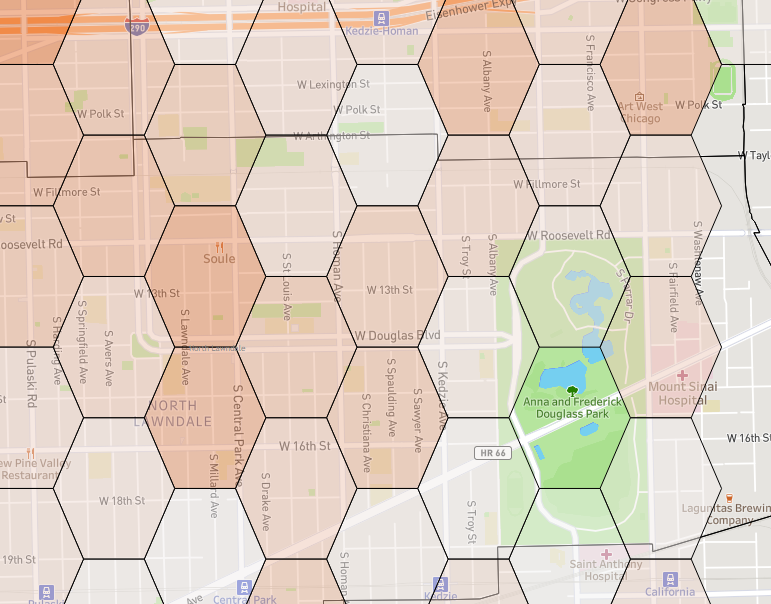

```{r global-options, include=FALSE}
knitr::opts_chunk$set(echo = TRUE, 
                      warning = FALSE, 
                      message = FALSE,
                      R.options = list(width=80),
                      fig.align="center")
```

## Introduction

In today's justice and public safety landscape, data-driven decision-making is essential for addressing complex challenges. Recently, I was inspired by the University of Chicago Crime Lab’s Chicago Summer Violence analysis and interactive map, which showcases an innovative approach to public safety issues. Motivated by their work and leveraging data from the City of Chicago Violence Reduction Dashboard, I created my own version of the dashboard with some improvements and customizations I have found in my career to be instrumental in conveying critical and timely public safety data to practitioners. I’m excited to introduce my Chicago Summer Violence Dashboard, highlighting its features, data sources, and its potential impact on violence reduction strategies.

What caught my attention with the Crime Lab's Summer Violence map was their use of a raster grid analysis overlaid on top of Chicago, a practical method to group points across a large city like Chicago. This method is particularly effective due to the political and socioeconomic nature of traditional, antiquated geographies in the United States. Police boundaries, neighborhoods, and even political districts rarely change, and often do not change through a rigorous data-driven process. Therefore, uniform raster grids provide a structured, yet effective GIS mapping technique. 

That being said, the particular 45-degree shifted square grid used by Crime Lab left me wanting more. Instead of a traditional square raster grid application, I made use of hexagons to capture both the staggering of latitude and longitude points from the Chicago Data Portal (done to 'randomize' exact locations of shootings) and eliminate the sharp edges and potential abnormalities from the 45-degree angled square used by the Crime Lab, which may not properly conform to street segments in Chicago.

## Hexagon Grids for Spatial Analysis

In creating my Chicago Summer Violence Dashboard, I relied heavily on a fantastic tutorial by Sarah Battersby ([twitter](https://x.com/mapsoverlord)) detailed in a blog post on the Tableau Community site, titled [How to Create Hexagonal Grids for Spatial Aggregation in Tableau](https://community.tableau.com/s/news/a0A4T000001v7VBUAY/how-to-create-hexagonal-grids-for-spatial-aggregation-in-tableau) This tutorial provided a clear and comprehensive guide on generating hexagonal grids using QGIS, which I then integrated into Tableau for spatial analysis. 

The only change I made from Sarah's tutorial was the sizing of the hexagon grid to better reflect the City of Chicago and arrange better within Chicago Community Areas and CPD Districts.

{width="55%"}


Important note for introducing the hexagon grids into Tableau is to make use of the grid ID. Spatial Joins in Tableau, while possible, can significantly degrade dashboard performance. As a result, I built the hexagon grids and performed spatial joins for both the City of Chicago Shooting data and ShotSpotter data in QGIS.

## Chicago Violence Reduction Dashboard Data

{width="250"}


The Chicago Data Portal offers a variety of data sources from city organizations, including public safety and the Chicago Police Department (CPD). For this analysis, I utilized the Victims of Homicides and Non-Fatal Shootings and ShotSpotter Alerts datasets. While the Crime Lab's analysis took a different approach by incorporating robbery data from the city's larger crime dataset, I believe a more focused approach on weapon-related or firearm-related incidents would have been beneficial for their analysis.

That being said,I placed greater emphasis on ShotSpotter data, not only due to the recent discussions about its future in Chicago but also because of my prior experience working with this data. ShotSpotter has proven effective in identifying areas with high levels of gunfire, regardless of whether injuries occurred or 9-1-1 calls were made. This makes it a valuable resource for pinpointing locations that require immediate attention and intervention.

## Chicago Summer Violence Tableau Dashboard

In Tableau Public Desktop, I loaded the hexagon GeoJSON file and created inner joins with three boundary layers: Community Areas, Police Beats, and Police Districts. These joins were based on the hexagon grid ID, which I already spatially joined in QGIS to avoid less efficient spatial joins within Tableau. After setting up the boundaries, I established relationships on the hexagon grid ID between the boundaries and the two datasets from the Chicago Data Portal.

{width="300"}

{width="300"}


Once the data was loaded, the next step was building the dashboard. While I won't delve into the dashboard design details here (potentially saving that for another post), the unique aspect of this analysis was working with the hexagon grids and mapping layers in Tableau. Visualizing the grids works similarly to visualizing any mapping layer through the geometry and generated latitude and longitude of the polygons. The hexagon unique ID is crucial for Tableau to identify each unique grid and associate shootings and ShotSpotter alerts with those grids, enabling the creation of choropleths and accurate counts.

Parameters are invaluable for allowing users to enable or disable each layer within the dashboard. For example, when a user selects the Police Districts map layer, a Tableau parameter combined with a calculated field isolates this selection, preventing the geometry data of other layers from being visualized.


{width="50%"}

I also leveraged Tableau's dynamic visibility feature to swap the temporal visualizations between Shooting and ShotSpotter data based on the dashboard parameter. This allows users to seamlessly switch between different datasets without cluttering the interface. By using dynamic visibility, I was able to maintain a clean and user-friendly dashboard that adapts to the viewer’s needs, making it easier to compare and analyze different types of data or data from separate data sources.


The final technical complexity involved determining the top x% of hexagon grids across Chicago for shootings and ShotSpotter alerts. I’ll keep this brief, but the calculated fields can be found in my Tableau Public Dashboard. In summary, for both shootings and ShotSpotter alerts, I calculated the counts for each grid and uniquely ranked them. Simultaneously, I allowed users to input any percentage of top hexagon grids to retain, offering a variation from Crime Lab's fixed 5% or 10% selection. I then calculated the number of grids this user selection represented. Finally, I created a calculation for Tableau to retain only the number of ranked grids corresponding to the user selection. Thus, if a user selected a top percentage that resulted in 500 grids, Tableau would only visualize the top 500 grids ranked for either shootings or ShotSpotter alerts.

You can find the dashboard on my Tableau Public page or embedded below:

<div class='tableauPlaceholder' id='viz1717195017628' style='position: relative'><noscript><a href='#'></a></noscript><object class='tableauViz'  style='display:none;'><param name='host_url' value='https%3A%2F%2Fpublic.tableau.com%2F' /> <param name='embed_code_version' value='3' /> <param name='site_root' value='' /><param name='name' value='ChicagoSummerViolenceAnalysis2019-2023&#47;ChicagoSummerViolence' /><param name='tabs' value='no' /><param name='toolbar' value='yes' /><param name='static_image' value='https:&#47;&#47;public.tableau.com&#47;static&#47;images&#47;Ch&#47;ChicagoSummerViolenceAnalysis2019-2023&#47;ChicagoSummerViolence&#47;1.png' /> <param name='animate_transition' value='yes' /><param name='display_static_image' value='yes' /><param name='display_spinner' value='yes' /><param name='display_overlay' value='yes' /><param name='display_count' value='yes' /><param name='language' value='en-US' /><param name='filter' value='publish=yes' /></object></div>                <script type='text/javascript'>                    var divElement = document.getElementById('viz1717195017628');                    var vizElement = divElement.getElementsByTagName('object')[0];                    if ( divElement.offsetWidth > 800 ) { vizElement.style.width='1654px';vizElement.style.height='1196px';} else if ( divElement.offsetWidth > 500 ) { vizElement.style.width='1654px';vizElement.style.height='1196px';} else { vizElement.style.width='100%';vizElement.style.height='3327px';}                     var scriptElement = document.createElement('script');                    scriptElement.src = 'https://public.tableau.com/javascripts/api/viz_v1.js';                    vizElement.parentNode.insertBefore(scriptElement, vizElement);                </script>

## Conclusion

Building the Chicago Summer Violence Dashboard was both a challenging and rewarding experience. By using hexagon grids and Tableau's advanced mapping and dynamic visibility features, I aimed to create a tool that provides clear and actionable insights into violence trends across the city.

I hope you find this dashboard useful and easy to navigate. Feel free to explore the data, customize the views, and share your insights. Your feedback is always welcome as I continue to refine and improve this tool.

## Acknowledgments

This blog post was structured and written with the assistance of OpenAI's ChatGPT through one of my customGPT's.  These tools helped streamline the writing process, making it more clear and concise for all audiences. I also leveraged the new GPT 4-o model in dashboard design, accessibility, and analysis. Utilizing advanced AI technologies allowed me to focus more on the insights and technical aspects of the dashboard creation, ensuring that the information presented is accessible and engaging for readers.


